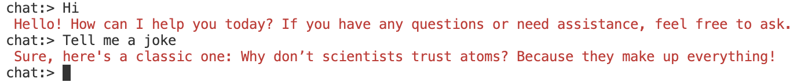

# gpt4all-typescript-sample

Sample to setup gpt4all with TypeScript.
Showcase for a simple chat in your command line.



## Setup

```sh
npm install
```

## Run project

To run the project, first you should activate the TypeScript watch:

```sh
npm run watch
```

Afterwards you can execute the sample from the compiled JS sources in the `./dist` folder:

```sh
npm run start
# or
node ./dist/index.js
```
